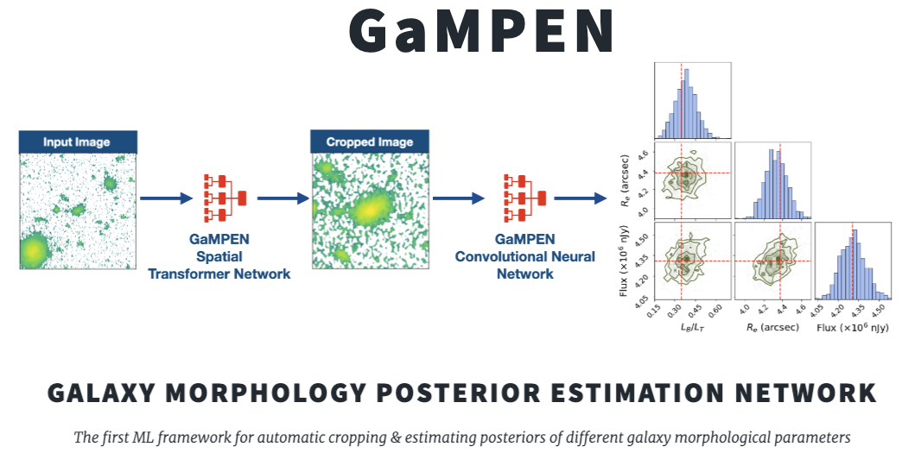

[](https://github.com/aritraghsh09/GaMPEN/actions/workflows/main.yml)
[](https://gampen.readthedocs.io/en/latest/?badge=latest)
[](https://www.python.org/downloads/)
[](https://github.com/aritraghsh09/GaMPEN/blob/master/LICENSE)
[](https://github.com/psf/black)
[](https://zenodo.org/badge/latestdoi/299731956)
[](https://doi.org/10.3847/1538-4357/ac7f9e)
[](https://arxiv.org/abs/2207.05107)

<hr>



<hr>

The Data Reduced AGN + Galaxy Optical Network (DRAGON) is a novel 
convolutional neural network that, when trained, accurately differentiates 
between single AGN, dual AGN, offset AGN, and galaxy mergers in large
sky survey fields. The architecture is loosely inspired by the GaMorNet 
architecture.

DRAGON is one of the first of its kind to differentiate between 
extended and point source morphologies. It is shown to be
highly accurate, finding double the number of known dual AGN
candidates in the HSC field with high confidence. DRAGON
can be adapted to work on both ground and space-based imaging.

Once trained, it takes DRAGON on the order of a milli-second to perform a
single model evaluation on a GPU. Thus, DRAGON is ready for large galaxy samples 
expected from upcoming large imaging surveys, such as Rubin-LSST, Euclid, and NGRST.

# Documentation

DRAGON's documentation will be available in this repository and also hosted 
on [readthedocs.io](https://dragon.readthedocs.io/) . The documentation is
not complete; for usage, please get in touch with us!

For access to the Public Data Release associated with this project,
please go to the [DragonCandidates](https://github.com/auroriasjn/DRAGONCandidates) repository.

# Publication

DRAGON was initially introduced in this [ApJ
paper](https://iopscience.iop.org/article/10.3847/1538-4357/ac7f9e)

An updated record of DRAGON's trained models and catalogs produced are
maintained [here](http://gampen.ghosharitra.com/)

## Attribution Info.
Please cite the above-mentioned publication if you make use of this software
module or some code herein.

``` tex
@article{Ghosh2022,
author = {Aritra Ghosh and C. Megan Urry and Amrit Rau and Laurence Perreault-Levasseur and Miles Cranmer and Kevin Schawinski and Dominic Stark and Chuan Tian and Ryan Ofman and Tonima Tasnim Ananna and Connor Auge and Nico Cappelluti and David B. Sanders and Ezequiel Treister},
doi = {10.3847/1538-4357/ac7f9e},
issn = {0004-637X},
issue = {2},
journal = {The Astrophysical Journal},
month = {8},
pages = {138},
title = {GaMPEN: A Machine-learning Framework for Estimating Bayesian Posteriors of Galaxy Morphological Parameters},
volume = {935},
year = {2022},
}
```

# License

Copyright 2024 Isaac Moskowitz, Jeremy Ng & contributors

Made available under a [GNU GPL
v3.0](https://github.com/aritraghsh09/GaMPEN/blob/master/LICENSE)
license.

# Contributors

DRAGON and its initial documentation were initially developed by 
[Jeremy Ng](https://linkedin.com/ngjeremyed) and [Isaac Moskowitz](www.linkedin.com/in/isaac-moskowitz-2255662a9)

For an updated list of all current contributors, please see
[here](https://github.com/aritraghsh09/GaMPEN/graphs/contributors)

# Getting Help/Contributing

If you have a question, please send me an e-mail either to `isaac.moskowitz@yale.edu` or
`jeremy.ng@yale.edu`.

If you have spotted a bug in the code/documentation or you want to
propose a new feature, please feel free to open an issue/a pull request
on GitHub.
